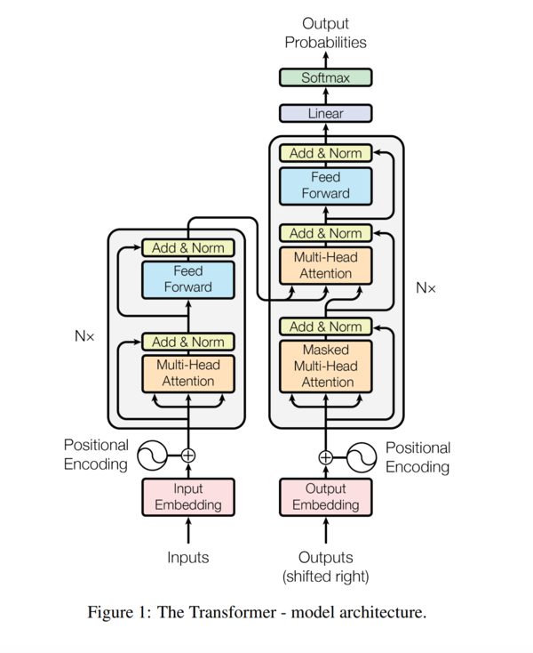

# ChatBot(seq2seq)
NLG를 활용한 ChatBot을 개발함  

  


# Learning Data
Title|Contents|Other
--|--|--
데이터 이름|size_again
데이터 용도|복통,두통과 관련한 간단한 데이터 제작
데이터 출처| @JinSeoYon

# Requirement
Python 3.6.6   
tensorflow 1.11   
konlpy   
pandas   
sklearn   

# Project Structure
    .
    ├── data_in                     # 데이터가 존재하는 영역
        ├── ChatBotData.csv         # 전체 데이터
        ├── ChatBotData.csv_short   # 축소된 데이터 (테스트 용도)
        ├── README.md               # 데이터 저자 READMD 파일
    ├── data_out                    # 출력 되는 모든 데이터가 모이는 영역
        ├── vocabularyData.voc      # 사전 파일
        ├── check_point             # check_point 저장 공간
    ├── configs.py                  # 모델 설정에 관한 소스
    ├── data.py                     # data 전처리 및 모델에 주입되는 data set 만드는 소스
    ├── main.py                     # 전체적인 프로그램이 시작되는 소스
    ├── model.py                    # 모델이 들어 있는 소스
    └── predict.py                  # 학습된 모델로 실행 해보는 소스    
   

# Config
```
tf.app.flags.DEFINE_integer('batch_size', 64, 'batch size')  # 배치 크기
tf.app.flags.DEFINE_integer('train_steps', 20000, 'train steps')  # 학습 에포크
tf.app.flags.DEFINE_float('dropout_width', 0.5, 'dropout width')  # 드롭아웃 크기
tf.app.flags.DEFINE_integer('embedding_size', 128, 'embedding size')  # 임베딩 크기 
tf.app.flags.DEFINE_float('learning_rate', 1e-3, 'learning rate')  # 학습률
tf.app.flags.DEFINE_integer('shuffle_seek', 1000, 'shuffle random seek')  # 셔플 시드값
tf.app.flags.DEFINE_integer('max_sequence_length', 25, 'max sequence length')  # 시퀀스 길이
tf.app.flags.DEFINE_integer('model_hidden_size', 128, 'model weights size')  # 모델 가중치 크기
tf.app.flags.DEFINE_integer('ffn_hidden_size', 512, 'ffn weights size')  # ffn 가중치 크기
tf.app.flags.DEFINE_integer('attention_head_size', 4, 'attn head size')  # 멀티 헤드 크기
tf.app.flags.DEFINE_integer('layer_size', 2, 'layer size')  # 논문은 6개 레이어이나 2개 사용 학습 속도 및 성능 튜닝
tf.app.flags.DEFINE_string('data_path', '../data_in/ChatBotData.csv', 'data path')  # 데이터 위치
tf.app.flags.DEFINE_string('vocabulary_path', './data_out/vocabularyData.voc', 'vocabulary path')  # 사전 위치
tf.app.flags.DEFINE_string('check_point_path', './data_out/check_point', 'check point path')  # 체크 포인트 위치
tf.app.flags.DEFINE_boolean('tokenize_as_morph', False, 'set morph tokenize')  # 형태소에 따른 토크나이징 사용 유무
tf.app.flags.DEFINE_boolean('xavier_initializer', True, 'set xavier initializer')  # 형태소에 따른 토크나이징 사용 유무  
```

# Usage
python main.py

# Predict
python predict.py 
어디아파 : 안녕? 어디가 아파?  \n
나 : 위가 쓰리고 배가 아파  \n
어디아파 : 위염인것 같아요. 위염에는 \n

# Reference
Title|Contents
--|--
Data|[Chatbot data](https://github.com/songys/Chatbot_data)  
Paper|[Attention is all you need](https://arxiv.org/abs/1706.03762)

<!--
# Author
Jin Seo Yon / (sheoyonj@naver.com)
-->
